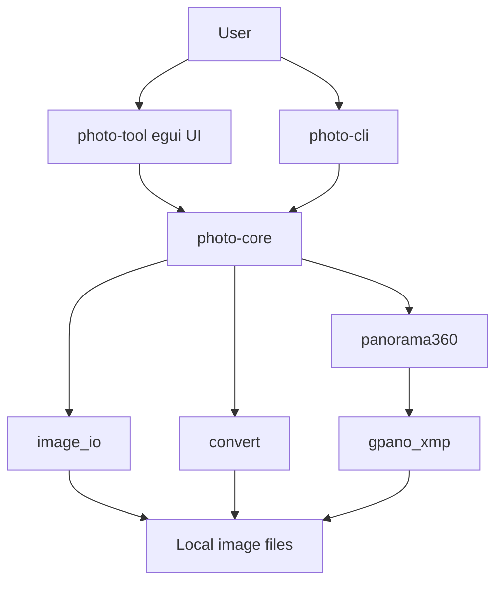

# Photo Tool Functional Specification

## 1. Scope

Build the first working Rust + egui version of Photo Tool.

This specification is based on `plan.md` and covers the first implementation slice:

- Rust workspace setup
- Reusable image-processing core
- Minimal CLI for validation and automation
- egui desktop UI for opening, previewing, converting, and exporting 360-compatible images
- Later slices now include folder browsing, batch conversion, basic edits, layer composition, per-text-layer font selection, and editable project files.
- Tests for core conversion and GPano/XMP output

## 2. Product Requirements

### 2.1 Image Viewer

The desktop app must allow the user to:

- Open one image file.
- Preview the image.
- Inspect basic file information.
- Convert the opened image to another supported format.
- Export the opened image as a 360-compatible JPEG.

### 2.2 Conversion

The core library must convert a source image to:

- JPEG
- PNG
- WEBP
- BMP
- TIFF

JPEG quality must be configurable.

When exporting to a format that does not support alpha, transparent pixels must be flattened against a configurable background color.

### 2.3 360-Compatible Export

The core library must generate a JPEG that:

- Has a 2:1 equirectangular-compatible size.
- Contains GPano XMP metadata.
- Supports three layout modes:
  - Pad to 2:1
  - Stretch to 2:1
  - Center crop to 2:1

This is not full panorama stitching. It converts one source image into a 360-compatible container image.

### 2.4 CLI

The CLI must support:

```text
photo-cli info <input>
photo-cli convert <input> <output> --format <format> --quality <quality>
photo-cli pano360 <input> <output> --mode <mode> --width <width> --quality <quality>
```

The CLI exists to provide repeatable smoke tests and future automation.

### 2.5 Desktop UI

The egui app must provide:

- Open image button
- Open folder button and next/previous image browsing
- Image preview viewport
- File metadata panel
- Basic edit panel for rotate, flip, resize, and crop
- Essential adjustment tools for brightness, contrast, saturation, exposure, blur, sharpen, grayscale, and invert
- Output format selector
- Quality slider
- Save as new file button for the current edited/composited result
- Save converted file button
- Batch conversion panel
- 360 mode selector
- 360 export button
- Composition panel with editable text and image/icon layers
- Per-text-layer system font selection
- Font dropdown previews rendered in each font where possible
- Selected text-layer bounds based on measured rendered text size
- Layer alignment controls for left, center, right, top, middle, and bottom
- Save/open `.photo-project` files that preserve the background image and editable layers
- Status/error message area

The UI must use a restrained utility design. It should prioritize clarity, dense information, and predictable controls.

### 2.6 Composition

The desktop app must allow the user to:

- Add text layers with editable text, font, font size, color, opacity, stroke, and shadow.
- Add image/icon layers from files.
- Paste image layers from the clipboard.
- Select, drag, reorder, duplicate, hide/show, delete, and nudge layers.
- Export the flattened composition as a normal image.
- Save and reopen an editable project file for continued editing.

Project files are JSON documents with base64 PNG payloads for the background and image layers. Missing font files must not prevent opening a project; rendering falls back to the system default font.

## 3. Architecture Blueprint



## 4. Crate Responsibilities

### 4.1 `photo-core`

Status: new crate.

Responsibilities:

- Detect supported image formats.
- Inspect image metadata.
- Load and save images.
- Convert between supported formats.
- Flatten alpha for non-alpha outputs.
- Generate 2:1 panorama-compatible images.
- Inject GPano XMP metadata into JPEG files.

### 4.2 `photo-cli`

Status: new crate.

Responsibilities:

- Parse command-line arguments.
- Call `photo-core`.
- Print concise success/error output.

### 4.3 `photo-tool`

Status: new crate.

Responsibilities:

- Render egui desktop interface.
- Load preview texture.
- Call `photo-core` for conversion and panorama export.
- Keep user-facing status visible.

## 5. Function Inventory

### `SupportedFormat::from_extension`

Status: new function.

Purpose:

- Convert a path extension into a supported image format.

Inputs:

- `extension: &str`

Output:

- `Option<SupportedFormat>`

Edge cases:

- Uppercase extensions must work.
- Unknown extensions return `None`.

### `SupportedFormat::from_path`

Status: new function.

Purpose:

- Detect supported format from a file path.

Inputs:

- `path: impl AsRef<Path>`

Output:

- `Option<SupportedFormat>`

Edge cases:

- Missing extension returns `None`.

### `SupportedFormat::image_format`

Status: new function.

Purpose:

- Map `SupportedFormat` to `image::ImageFormat`.

Inputs:

- `self`

Output:

- `image::ImageFormat`

### `inspect_image`

Status: new function.

Purpose:

- Read basic image information without changing the file.

Inputs:

- `path: impl AsRef<Path>`

Output:

- `Result<ImageInfo>`

Edge cases:

- Missing file.
- Unsupported format.
- Decode error.

### `load_dynamic_image`

Status: new function.

Purpose:

- Decode an image into `image::DynamicImage`.

Inputs:

- `path: impl AsRef<Path>`

Output:

- `Result<DynamicImage>`

### `convert_image`

Status: new function.

Purpose:

- Convert one input image to one output image.

Inputs:

- `input: impl AsRef<Path>`
- `output: impl AsRef<Path>`
- `options: ConvertOptions`

Output:

- `Result<ConvertResult>`

Edge cases:

- Unsupported output format.
- JPEG/BMP output with alpha source.
- Invalid quality value.
- Output write failure.

### `flatten_alpha`

Status: new function.

Purpose:

- Composite transparent pixels over a background color.

Inputs:

- `image: &DynamicImage`
- `background: [u8; 4]`

Output:

- `DynamicImage`

### `make_equirectangular`

Status: new function.

Purpose:

- Transform one image into a 2:1 equirectangular-compatible image.

Inputs:

- `image: &DynamicImage`
- `options: &PanoramaOptions`

Output:

- `DynamicImage`

Edge cases:

- Very small images.
- Odd target widths.
- Source dimensions already 2:1.

### `write_panorama_jpeg`

Status: new function.

Purpose:

- Create a 360-compatible JPEG with GPano metadata.

Inputs:

- `input: impl AsRef<Path>`
- `output: impl AsRef<Path>`
- `options: PanoramaOptions`

Output:

- `Result<PanoramaResult>`

### `build_gpano_xmp`

Status: new function.

Purpose:

- Build a GPano XMP XML packet for a 2:1 panorama image.

Inputs:

- `width: u32`
- `height: u32`

Output:

- `String`

### `inject_xmp_into_jpeg`

Status: new function.

Purpose:

- Insert an APP1 XMP segment into JPEG bytes.

Inputs:

- `jpeg: &[u8]`
- `xmp: &str`

Output:

- `Result<Vec<u8>>`

Edge cases:

- Input is not JPEG.
- XMP segment is too large.

## 6. Data Types

### `ImageInfo`

Fields:

- `path: PathBuf`
- `format: SupportedFormat`
- `width: u32`
- `height: u32`
- `color_type: String`
- `file_size: u64`

### `ConvertOptions`

Fields:

- `format: SupportedFormat`
- `quality: u8`
- `background: [u8; 4]`

Validation:

- `quality` must be clamped to 1..=100.

### `PanoramaMode`

Variants:

- `Pad`
- `Stretch`
- `Crop`

### `PanoramaOptions`

Fields:

- `mode: PanoramaMode`
- `target_width: Option<u32>`
- `quality: u8`
- `background: [u8; 4]`

Validation:

- Target width must be at least 2.
- Effective output width must be even.
- Output height is always width / 2.

### `ComposeDocument`

Fields:

- `background: DynamicImage`
- `layers: Vec<ComposeLayer>`

### `TextLayer`

Fields:

- `name: String`
- `text: String`
- `font_path: Option<PathBuf>`
- `x: i32`
- `y: i32`
- `font_size: f32`
- `color: [u8; 4]`
- `opacity: f32`
- `stroke: bool`
- `shadow: bool`
- `visible: bool`

### `ImageLayer`

Fields:

- `name: String`
- `image: DynamicImage`
- `x: i32`
- `y: i32`
- `width: u32`
- `height: u32`
- `opacity: f32`
- `visible: bool`

## 7. Test Cases

### Format detection

- `jpg` maps to JPEG.
- `JPEG` maps to JPEG.
- Unknown extension returns `None`.

### Conversion

- PNG can be converted to JPEG.
- PNG can be converted to WEBP.
- Alpha input converted to JPEG is flattened.

### 360 export

- Pad mode returns 2:1 dimensions.
- Stretch mode returns 2:1 dimensions.
- Crop mode returns 2:1 dimensions.
- Written JPEG contains `GPano:UsePanoramaViewer`.
- Written JPEG can still be decoded by the `image` crate.

### Composition

- Text layers render over the background image.
- Image layers render over the background image.
- Text layer font paths are optional and fall back to the default font.
- Project files preserve text layer settings, image layer PNG data, visibility, position, size, and opacity.

## 8. Validation Commands

```powershell
cargo fmt --check
cargo clippy --workspace --all-targets -- -D warnings
cargo test --workspace
cargo build --workspace
```

## 9. Initial UI Design Direction

Aesthetic direction:

- Industrial utility.

DFII:

- Aesthetic impact: 3
- Context fit: 5
- Implementation feasibility: 5
- Performance safety: 5
- Consistency risk: 1
- Score: 17

Design system:

- Dense panels.
- Clear toolbar.
- Neutral dark surface.
- Blue accent for primary actions.
- No decorative cards.
- Stable toolbar and side panel dimensions.

The first implementation should favor working controls and readable state over ornamental polish.
